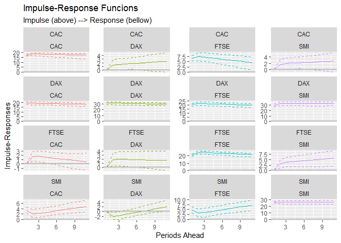
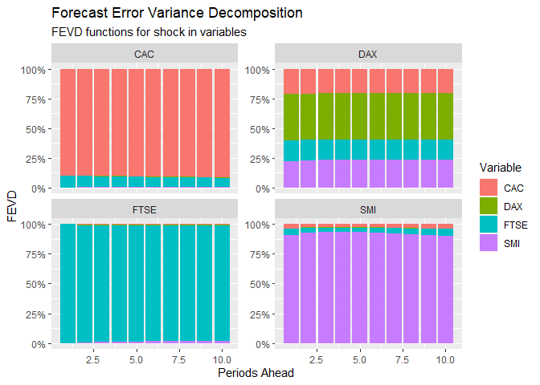
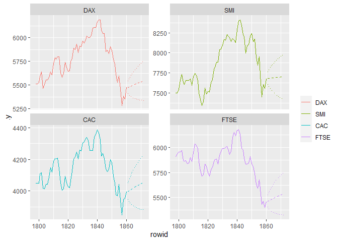

<!-- README.md is generated from README.Rmd. Please edit that file -->

# tidyvars

<!-- badges: start -->
<!-- badges: end -->

`tidyvars` extend tidiers for VAR modelling in R.

## Installation

You can install the development version of `tidyvars` like so:

``` r
# FILL THIS IN! HOW CAN PEOPLE INSTALL YOUR DEV PACKAGE?
```

## Tidy Tibbles

This is a basic example which shows you how to solve a common problem:

``` r
library(tidyvars)
library(ggplot2)

mod <- vars::VAR(EuStockMarkets, p = 2)

# tidy tibbles
tv_tidy(mod)
#> # A tibble: 36 x 6
#>    group term    estimate sdt.error statistic   p.value
#>    <chr> <fct>      <dbl>     <dbl>     <dbl>     <dbl>
#>  1 DAX   DAX.l1    0.996     0.0420    23.7   7.67e-109
#>  2 DAX   SMI.l1   -0.102     0.0293    -3.47  5.26e-  4
#>  3 DAX   CAC.l1    0.0468    0.0458     1.02  3.07e-  1
#>  4 DAX   FTSE.l1   0.0927    0.0360     2.58  1.01e-  2
#>  5 DAX   DAX.l2   -0.0219    0.0419    -0.522 6.01e-  1
#>  6 DAX   SMI.l2    0.117     0.0293     3.98  7.18e-  5
#>  7 DAX   CAC.l2   -0.0373    0.0460    -0.811 4.17e-  1
#>  8 DAX   FTSE.l2  -0.0925    0.0361    -2.56  1.05e-  2
#>  9 DAX   const    -3.67     13.4       -0.275 7.84e-  1
#> 10 SMI   DAX.l1    0.0119    0.0517     0.230 8.18e-  1
#> # i 26 more rows

# glance
tv_glance(mod)
#> # A tibble: 1 x 4
#>   lag.order  logLik  nobs     n
#>       <dbl>   <dbl> <dbl> <dbl>
#> 1         2 -33954.  1858  1860

# augment
tv_augment(mod)
#> # A tibble: 7,440 x 5
#>    rowid .asset    .x .fitted   .resid
#>    <int> <chr>  <dbl>   <dbl>    <dbl>
#>  1     1 DAX    1629.   1609.  -2.66  
#>  2     1 SMI    1678.   1687.  -8.86  
#>  3     1 CAC    1773.   1749. -30.6   
#>  4     1 FTSE   2444.   2463. -14.6   
#>  5     2 DAX    1614.   1601.  19.7   
#>  6     2 SMI    1688.   1674.   9.99  
#>  7     2 CAC    1750.   1715.  -6.88  
#>  8     2 FTSE   2460.   2448.  22.3   
#>  9     3 DAX    1607.   1618.   0.0355
#> 10     3 SMI    1679.   1685.   1.71  
#> # i 7,430 more rows

# tidy model checking (normlity test)
tv_normality_test(mod)
#> # A tibble: 3 x 5
#>   .test    .statistic .parameter .p.value .method                     
#>   <chr>         <dbl>      <dbl>    <dbl> <chr>                       
#> 1 JB            9979.          8        0 JB-Test (multivariate)      
#> 2 Skewness       146.          4        0 Skewness only (multivariate)
#> 3 Kurtosis      9832.          4        0 Kurtosis only (multivariate)

# tidy model checking (arch effects)
tv_serial_test(mod)
#> # A tibble: 4 x 5
#>   .test         .statistic .parameter .p.value .method                      
#>   <fct>              <dbl>      <dbl>    <dbl> <chr>                        
#> 1 PT.asymptotic     463.          224 0        Portmanteau Test (asymptotic)
#> 2 PT.adjusted       465.          224 0        Portmanteau Test (adjusted)  
#> 3 BG                183.           80 4.28e-10 Breusch-Godfrey LM test      
#> 4 ES                  2.32         80 3.76e-10 Edgerton-Shukur F test

# tidy causality test
tv_causality(mod)
#> # A tibble: 8 x 6
#>   .asset .test   .statistic .parameter  .p.value .method                        
#>   <fct>  <chr>        <dbl>      <dbl>     <dbl> <chr>                          
#> 1 DAX    granger      0.895          6 0.497     Granger causality H0: DAX do n~
#> 2 SMI    granger      4.70           6 0.0000874 Granger causality H0: SMI do n~
#> 3 CAC    granger      3.79           6 0.000899  Granger causality H0: CAC do n~
#> 4 FTSE   granger      3.86           6 0.000750  Granger causality H0: FTSE do ~
#> 5 DAX    instant    763.             3 0         H0: No instantaneous causality~
#> 6 SMI    instant    691.             3 0         H0: No instantaneous causality~
#> 7 CAC    instant    702.             3 0         H0: No instantaneous causality~
#> 8 FTSE   instant    647.             3 0         H0: No instantaneous causality~

# tidy prediction
tv_predict(mod)
#> # A tibble: 40 x 6
#>    rowid .asset  fcst lower upper    CI
#>    <int> <chr>  <dbl> <dbl> <dbl> <dbl>
#>  1     1 DAX    5475. 5412. 5538.  63.2
#>  2     2 DAX    5481. 5392. 5570.  89.0
#>  3     3 DAX    5488. 5380. 5597. 109. 
#>  4     4 DAX    5495. 5370. 5620. 125. 
#>  5     5 DAX    5502. 5363. 5641. 139. 
#>  6     6 DAX    5509. 5357. 5661. 152. 
#>  7     7 DAX    5515. 5352. 5679. 163. 
#>  8     8 DAX    5522. 5348. 5696. 174. 
#>  9     9 DAX    5528. 5344. 5712. 184. 
#> 10    10 DAX    5535. 5341. 5728. 194. 
#> # i 30 more rows

# tidy FEVD
tv_fevd(mod)
#> # A tibble: 160 x 4
#>    rowid .asset .impact    .fevd
#>    <int> <chr>  <chr>      <dbl>
#>  1     1 DAX    DAX     1       
#>  2     1 DAX    SMI     0       
#>  3     1 DAX    CAC     0       
#>  4     1 DAX    FTSE    0       
#>  5     2 DAX    DAX     0.995   
#>  6     2 DAX    SMI     0.00204 
#>  7     2 DAX    CAC     0.000967
#>  8     2 DAX    FTSE    0.00177 
#>  9     3 DAX    DAX     0.994   
#> 10     3 DAX    SMI     0.00244 
#> # i 150 more rows

# tidy IRF
tv_irf(mod)
#> # A tibble: 176 x 6
#>    rowid .impulse .asset  .irf .lower .upper
#>    <int> <chr>    <chr>  <dbl>  <dbl>  <dbl>
#>  1     1 DAX      DAX     32.2   30.3   33.9
#>  2     1 DAX      SMI     29.8   26.6   32.3
#>  3     1 DAX      CAC     19.3   17.6   20.7
#>  4     1 DAX      FTSE    20.5   18.4   22.1
#>  5     2 DAX      DAX     31.9   29.5   33.8
#>  6     2 DAX      SMI     32.7   28.8   35.2
#>  7     2 DAX      CAC     19.4   17.1   20.9
#>  8     2 DAX      FTSE    22.0   19.5   23.9
#>  9     3 DAX      DAX     31.5   29.1   33.3
#> 10     3 DAX      SMI     32.9   28.7   35.4
#> # i 166 more rows
```

## Plotting

``` r
# autoplot method for IRF
autoplot(tv_irf(mod))
```



``` r

# autoplot method for IRF
autoplot(tv_fevd(mod))
```



``` r

# autoplot method for predict
autoplot(tv_predict(mod, n.ahead = 12))
```


