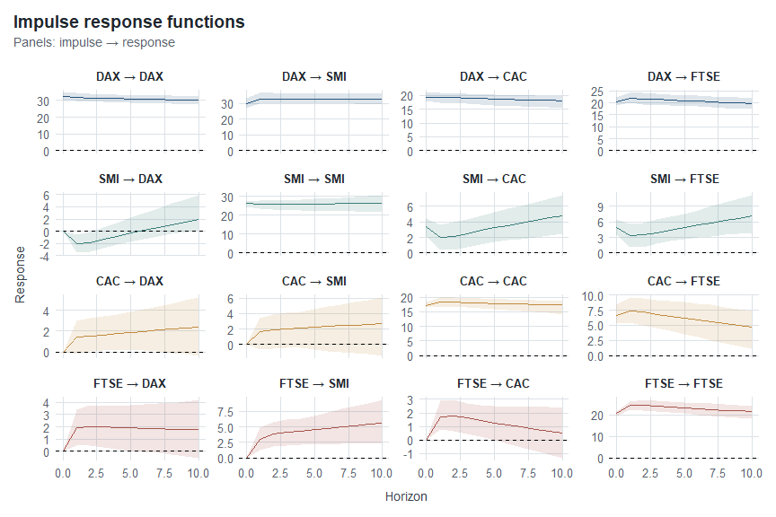
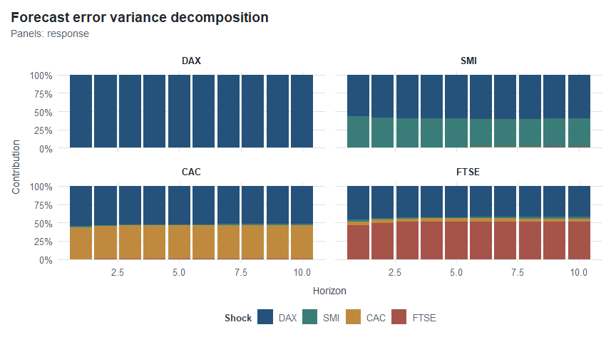
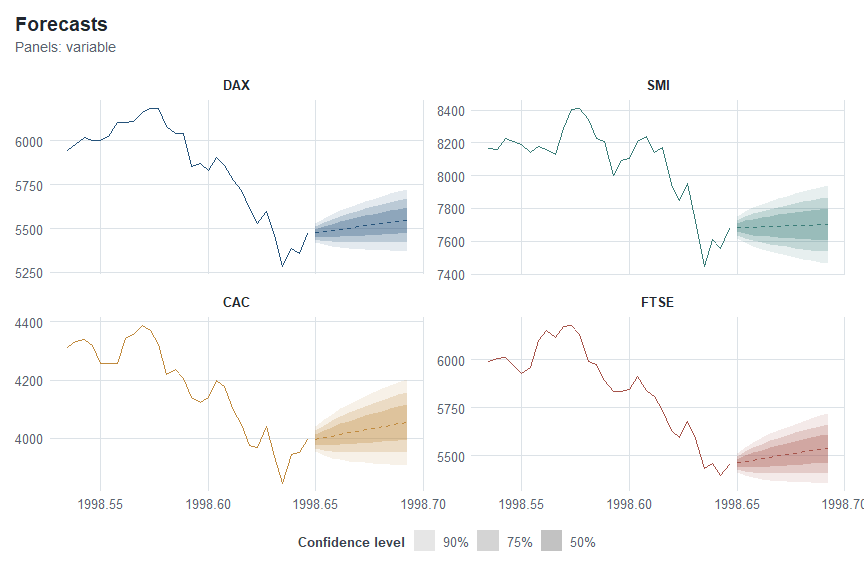

<!-- README.md is generated from README.Rmd. Please edit that file -->

# tidyvars

> A tidy workflow for VAR models

`tidyvars` provides a modern interface for inspecting, diagnosing,
transforming, forecasting, and visualizing Vector Autoregressive (VAR)
models fitted with `{vars}`.

It does not replace `{vars}` or reimplement VAR econometrics. Instead,
it organizes model results into consistent tidy objects that work
naturally with `{dplyr}`, `{tidyr}`, and `{ggplot2}`.

## Installation

`tidyvars` is currently under development. The latest version can be
installed from GitHub with:

``` r
devtools::install_github("Reckziegel/tidyvars")
```

## Quick start

Model estimation remains exactly where it belongs: in `{vars}`.

For this example, we use `EuStockMarkets`, which contains the levels of
four European equity indices: DAX, SMI, CAC, and FTSE.

``` r
library(tidyvars)
library(ggplot2)

model <- vars::VAR(EuStockMarkets, p = 2, type = "const")
```

The two-lag specification is intentionally simple and is used here to
illustrate the `tidyvars` workflow rather than to propose a preferred
empirical specification.

In applied work, unit-root and cointegration analysis should guide the
choice between a VAR in levels, a VAR in differences, or a VECM.

Once the model has been fitted, `tidyvars` provides a consistent
interface around its results.

## Inspect the model

Coefficient estimates, equation-level summaries, fitted values, and
residuals can be extracted directly into tidy tables.

``` r
tv_tidy(model)
#> <tidyvars coefficients>
#> Equations: 4 | Terms: 9
#> # A tibble: 36 × 6
#>    equation term    estimate std_error statistic   p_value
#>    <chr>    <chr>      <dbl>     <dbl>     <dbl>     <dbl>
#>  1 DAX      DAX.l1    0.996     0.0420    23.7   7.67e-109
#>  2 DAX      SMI.l1   -0.102     0.0293    -3.47  5.26e-  4
#>  3 DAX      CAC.l1    0.0468    0.0458     1.02  3.07e-  1
#>  4 DAX      FTSE.l1   0.0927    0.0360     2.58  1.01e-  2
#>  5 DAX      DAX.l2   -0.0219    0.0419    -0.522 6.01e-  1
#>  6 DAX      SMI.l2    0.117     0.0293     3.98  7.18e-  5
#>  7 DAX      CAC.l2   -0.0373    0.0460    -0.811 4.17e-  1
#>  8 DAX      FTSE.l2  -0.0925    0.0361    -2.56  1.05e-  2
#>  9 DAX      const    -3.67     13.4       -0.275 7.84e-  1
#> 10 SMI      DAX.l1    0.0119    0.0517     0.230 8.18e-  1
#> # ℹ 26 more rows
```

The coefficient estimates immediately reveal the persistence of the
index levels. Several own first lags are close to one, while significant
cross-market lagged effects also appear across the equations.

``` r
tv_glance(model)
#> <tidyvars equation summaries>
#> Equations: 4
#> # A tibble: 4 × 13
#>   equation r_squared adj_r_squared sigma statistic p_value    df log_lik    aic
#>   <chr>        <dbl>         <dbl> <dbl>     <dbl>   <dbl> <dbl>   <dbl>  <dbl>
#> 1 DAX          0.999         0.999  32.2   262882.       0     8  -9084. 18189.
#> 2 SMI          0.999         0.999  39.7   407363.       0     8  -9471. 18962.
#> 3 CAC          0.998         0.998  26.1   114737.       0     8  -8691. 17402.
#> 4 FTSE         0.999         0.999  30.2   242423.       0     8  -8964. 17948.
#> # ℹ 4 more variables: bic <dbl>, deviance <dbl>, df_residual <int>, n_obs <int>
```

The very high equation-level $R^2$ values are consistent with that
persistence. They should not, by themselves, be interpreted as evidence
of a well-specified VAR. Residual diagnostics remain essential.

``` r
tv_augment(model)
#> <tidyvars augmented data>
#> Variables: 4 | Observations: 1860
#> # A tibble: 7,440 × 5
#>    index variable observed fitted residual
#>    <dbl> <chr>       <dbl>  <dbl>    <dbl>
#>  1 1991. DAX         1629.    NA     NA   
#>  2 1991. SMI         1678.    NA     NA   
#>  3 1991. CAC         1773.    NA     NA   
#>  4 1991. FTSE        2444.    NA     NA   
#>  5 1992. DAX         1614.    NA     NA   
#>  6 1992. SMI         1688.    NA     NA   
#>  7 1992. CAC         1750.    NA     NA   
#>  8 1992. FTSE        2460.    NA     NA   
#>  9 1992. DAX         1607.  1609.    -2.66
#> 10 1992. SMI         1679.  1687.    -8.86
#> # ℹ 7,430 more rows
```

`tv_augment()` keeps the original observations in the output. Because
this model uses two lags, the initial observations consumed by the lag
structure remain visible with missing fitted values and residuals rather
than being silently discarded.

Because these objects are tidy, they can immediately enter a regular
data manipulation workflow:

``` r
model |>
  tv_tidy() |>
  dplyr::filter(p_value < 0.05) 
#> <tidyvars coefficients>
#> Equations: 4 | Terms: 7
#> # A tibble: 18 × 6
#>    equation term    estimate std_error statistic   p_value
#>    <chr>    <chr>      <dbl>     <dbl>     <dbl>     <dbl>
#>  1 DAX      DAX.l1    0.996     0.0420     23.7  7.67e-109
#>  2 DAX      SMI.l1   -0.102     0.0293     -3.47 5.26e-  4
#>  3 DAX      FTSE.l1   0.0927    0.0360      2.58 1.01e-  2
#>  4 DAX      SMI.l2    0.117     0.0293      3.98 7.18e-  5
#>  5 DAX      FTSE.l2  -0.0925    0.0361     -2.56 1.05e-  2
#>  6 SMI      SMI.l1    0.962     0.0361     26.7  9.57e-133
#>  7 SMI      FTSE.l1   0.145     0.0443      3.27 1.10e-  3
#>  8 SMI      FTSE.l2  -0.131     0.0445     -2.96 3.15e-  3
#>  9 CAC      SMI.l1   -0.0713    0.0237     -3.01 2.68e-  3
#> 10 CAC      CAC.l1    1.04      0.0371     28.0  4.93e-144
#> 11 CAC      FTSE.l1   0.0840    0.0291      2.88 3.98e-  3
#> 12 CAC      SMI.l2    0.0834    0.0237      3.52 4.48e-  4
#> 13 CAC      FTSE.l2  -0.0895    0.0292     -3.06 2.24e-  3
#> 14 FTSE     SMI.l1   -0.0912    0.0275     -3.32 9.15e-  4
#> 15 FTSE     FTSE.l1   1.18      0.0337     35.1  3.37e-207
#> 16 FTSE     SMI.l2    0.109     0.0274      3.98 7.14e-  5
#> 17 FTSE     FTSE.l2  -0.199     0.0338     -5.88 4.89e-  9
#> 18 FTSE     const    39.2      12.5         3.13 1.78e-  3
```

There is no need to manually navigate `model$varresult`, combine
equation-specific outputs, or reshape the results before analysis.

### Tidy by construction

`tidyvars` follows tidyverse naming conventions throughout its public
API and output schemas.

Normalized names use lower-case `snake_case`, such as:

``` text
std_error
p_value
r_squared
jarque_bera
portmanteau_asymptotic
```

At the same time, names supplied by the data are preserved. The original
market labels therefore remain `DAX`, `SMI`, `CAC`, and `FTSE`.

In other words, `tidyvars` standardizes the interface without rewriting
the user’s data.

## Diagnose the model

A convenient interface should make model weaknesses just as easy to
inspect as model results.

`tidyvars` exposes common VAR diagnostics as compact tidy objects while
leaving the underlying statistical calculations to `{vars}`.

#### Causality

``` r
tv_causality(model)
#> <tidyvars causality tests>
#> Causes: 4 | Tests: 2
#> # A tibble: 8 × 9
#>   cause test          statistic    df   df1   df2 boot_runs   p_value method    
#>   <chr> <chr>             <dbl> <dbl> <dbl> <dbl>     <dbl>     <dbl> <chr>     
#> 1 DAX   granger           0.895    NA     6  7396        NA 0.497     Granger c…
#> 2 DAX   instantaneous   763.        3    NA    NA        NA 0         H0: No in…
#> 3 SMI   granger           4.70     NA     6  7396        NA 0.0000874 Granger c…
#> 4 SMI   instantaneous   691.        3    NA    NA        NA 0         H0: No in…
#> 5 CAC   granger           3.79     NA     6  7396        NA 0.000899  Granger c…
#> 6 CAC   instantaneous   702.        3    NA    NA        NA 0         H0: No in…
#> 7 FTSE  granger           3.86     NA     6  7396        NA 0.000750  Granger c…
#> 8 FTSE  instantaneous   647.        3    NA    NA        NA 0         H0: No in…
```

The Granger-causality results are asymmetric. For this specification,
the null is not rejected for DAX, while SMI, CAC, and FTSE show strong
evidence of Granger causality for the rest of the system.

This means that lagged information from those indices contributes to
predicting other variables in the system, conditional on the model.
Granger causality is a statement about predictive content; it is not, by
itself, evidence of structural economic causation.

The instantaneous-causality tests are strongly significant for all four
indices, pointing to substantial contemporaneous dependence across the
European equity markets.

#### Normality

``` r
tv_normality_test(model)
#> <tidyvars normality tests>
#> Scopes: 1 | Tests: 3
#> # A tibble: 3 × 7
#>   scope        variable test        statistic    df p_value method              
#>   <chr>        <chr>    <chr>           <dbl> <dbl>   <dbl> <chr>               
#> 1 multivariate <NA>     jarque_bera     9979.     8       0 JB-Test (multivaria…
#> 2 multivariate <NA>     skewness         146.     4       0 Skewness only (mult…
#> 3 multivariate <NA>     kurtosis        9832.     4       0 Kurtosis only (mult…
```

Multivariate normality is strongly rejected. Both skewness and kurtosis
contribute to that result.

Non-normal residuals do not, by themselves, make the estimated VAR
coefficients meaningless, but they caution against relying uncritically
on inference that depends heavily on Gaussian finite-sample assumptions.

For financial data, this is an especially relevant diagnostic because
asymmetry, heavy tails, and large common shocks are common features of
the data-generating process.

#### Serial correlation

``` r
tv_serial_test(model)
#> <tidyvars serial tests>
#> Tests: 1
#> # A tibble: 1 × 8
#>   test                    lags statistic    df   df1   df2 p_value method       
#>   <chr>                  <int>     <dbl> <dbl> <dbl> <dbl>   <dbl> <chr>        
#> 1 portmanteau_asymptotic    16      463.   224    NA    NA       0 Portmanteau …
```

The Portmanteau test strongly rejects residual independence at the
reported lag horizon.

For a substantive empirical analysis, this would be a reason to revisit
the specification before drawing strong conclusions from the model.
Possible considerations include the lag order, deterministic terms,
transformations, structural changes, or other omitted dynamics.

This is an important part of the workflow: `tidyvars` does not turn a
model into a good model. It makes its strengths and weaknesses easier to
inspect.

## Dynamic analysis

Once the model has been estimated and inspected, impulse response
functions and forecast error variance decompositions provide two
complementary views of its dynamics.

`{vars}` performs the underlying econometric calculations. `tidyvars`
organizes their results into stable, tidy representations.

``` r
set.seed(123)

irf  <- tv_irf(model)
fevd <- tv_fevd(model)
```

The resulting objects are still directly manipulable with `dplyr`.

For example:

``` r
irf |>
  dplyr::filter(
    impulse == "DAX",
    response == "SMI"
  )
#> <tidyvars IRF>
#> Impulses: 1 | Responses: 1 | Horizons: 0-10
#> # A tibble: 11 × 6
#>    horizon impulse response estimate lower upper
#>      <int> <chr>   <chr>       <dbl> <dbl> <dbl>
#>  1       0 DAX     SMI          29.8  26.9  33.0
#>  2       1 DAX     SMI          32.7  29.7  36.7
#>  3       2 DAX     SMI          32.9  29.7  36.6
#>  4       3 DAX     SMI          32.8  29.7  36.3
#>  5       4 DAX     SMI          32.8  29.6  36.1
#>  6       5 DAX     SMI          32.8  29.6  36.0
#>  7       6 DAX     SMI          32.8  29.6  35.9
#>  8       7 DAX     SMI          32.7  29.5  35.9
#>  9       8 DAX     SMI          32.7  29.5  35.9
#> 10       9 DAX     SMI          32.7  29.5  35.9
#> 11      10 DAX     SMI          32.6  29.4  35.9
```

Here, `DAX → SMI` means:

``` text
impulse → response
```

For this model, a DAX innovation is associated with a positive and
persistent response from SMI over the displayed horizon.

The same output can be visualized directly:

``` r
irf |> 
  autoplot(layout = "wrap") +
  theme_tidyvars() +
  palette_tidyvars()
```



The complete IRF panel reveals that shock propagation is heterogeneous:
some responses are persistent, others are more transitory, and some
initially move in the opposite direction before converging toward a
different path.

The shaded confidence bands make the uncertainty around each response
visible rather than presenting the estimated path in isolation.

As with any VAR analysis, substantive interpretation of impulse
responses depends on an adequately specified model. When orthogonalized
innovations are used, interpretation also depends on the underlying
identification scheme and variable ordering.

### Forecast error variance decomposition

FEVD asks a related but different question.

Instead of tracing the path followed after an innovation, it measures
how much of a variable’s forecast-error variance is attributable to each
shock in the system.

``` r
autoplot(fevd) +
  theme_tidyvars() +
  palette_tidyvars()
```



In this example, DAX innovations account for nearly all of DAX’s own
forecast uncertainty and for a meaningful share of the uncertainty in
the other markets. At the same time, own-market shocks remain important
for SMI, CAC, and FTSE.

Together, the two tools answer complementary questions:

``` text
IRF  → How does a shock propagate through time?
FEVD → How important is each shock for forecast uncertainty?
```

Both results remain regular tidy data, so individual responses,
impulses, shocks, horizons, or variables can be filtered before
visualization or further analysis.

## Forecasting

`tv_predict()` combines historical observations and forecasts in a
single tidy representation.

Multiple confidence levels can be requested directly:

``` r
prediction <- tv_predict(
  model,
  n_ahead = 12,
  level   = c(0.50, 0.75, 0.90)
)

prediction
#> <tidyvars forecast>
#> Variables: 4 | History: 1860 | Forecast: 12
#> # A tibble: 7,584 × 8
#>    index variable type    level observed estimate lower upper
#>    <dbl> <chr>    <chr>   <dbl>    <dbl>    <dbl> <dbl> <dbl>
#>  1 1991. DAX      history    NA    1629.       NA    NA    NA
#>  2 1991. SMI      history    NA    1678.       NA    NA    NA
#>  3 1991. CAC      history    NA    1773.       NA    NA    NA
#>  4 1991. FTSE     history    NA    2444.       NA    NA    NA
#>  5 1992. DAX      history    NA    1614.       NA    NA    NA
#>  6 1992. SMI      history    NA    1688.       NA    NA    NA
#>  7 1992. CAC      history    NA    1750.       NA    NA    NA
#>  8 1992. FTSE     history    NA    2460.       NA    NA    NA
#>  9 1992. DAX      history    NA    1607.       NA    NA    NA
#> 10 1992. SMI      history    NA    1679.       NA    NA    NA
#> # ℹ 7,574 more rows
```

History is stored once, while forecast rows carry the corresponding
confidence level.

The resulting structure makes it possible to distinguish observed data,
point forecasts, and uncertainty without manually combining multiple
outputs from `{vars}`.

``` r
prediction |> 
  autoplot(n_history = 30) +
  theme_tidyvars() +
  palette_tidyvars()
```



The nested bands provide progressively wider views of forecast
uncertainty:

``` text
50% → inner interval
75% → intermediate interval
90% → outer interval
```

The solid line represents observed history, while the dashed line
represents the point forecast.

`n_history` changes only how much historical context is displayed. It
does not truncate or modify the forecast itself.

## Visualization

Visualization in `tidyvars` is deliberately modular.

`autoplot()` defines the **semantic structure** of a graph but does not
force the visual identity of the package.

This remains a regular ggplot:

``` r
autoplot(irf)
```

and can be customized with any standard ggplot2 component:

``` r
autoplot(irf) +
  ggplot2::theme_classic()
```

The optional `tidyvars` visual system separates layout from colour:

``` r
autoplot(irf) +
  theme_tidyvars() +
  palette_tidyvars()
```

`theme_tidyvars()` controls typography, spacing, facets, grids, legends,
and other structural elements. It does not change the colours used to
represent data.

`palette_tidyvars()` applies the package’s contextual colour identity
when explicitly requested.

In short:

``` text
theme_tidyvars()   → layout and typography
palette_tidyvars() → colours
```

Discrete colour and fill scales can also be used independently in
ordinary ggplot2 workflows:

``` r
ggplot(data, aes(x, y, colour = group)) +
  geom_line() +
  scale_color_tidyvars() +
  theme_tidyvars()
```

or:

``` r
ggplot(data, aes(x, y, fill = group)) +
  geom_col() +
  scale_fill_tidyvars() +
  theme_tidyvars()
```

The package therefore provides a visual identity without making that
identity mandatory.

## Why tidyvars?

Working directly with VAR results often involves navigating nested
lists, combining equation-specific outputs, reshaping matrices,
reconstructing temporal indices, and preparing data before it can be
analyzed or plotted.

`tidyvars` moves that work into a consistent package interface.

Its objects retain enough structure for informative printing and
specialized `autoplot()` methods while remaining ordinary tidy tabular
data that can be manipulated with the rest of the tidyverse.

The aim is not to estimate VAR models differently or more quickly. It is
to make the workflow around those models simpler:

If you already use `{vars}`, `tidyvars` lets you keep the econometric
tools you know while working with their results through a more tidy,
predictable, and composable interface.
